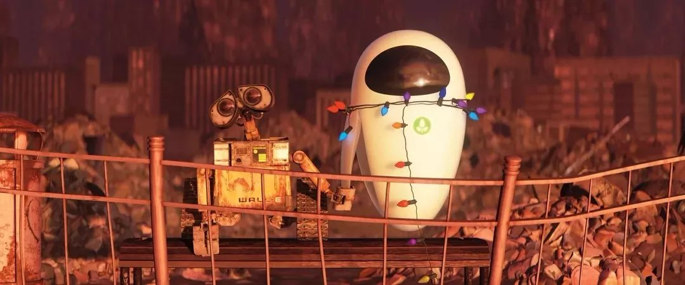

　　公元2805年，人类文明高度发展，却因污染和生活垃圾大量增加使得地球不再适于人类居住。地球人被迫乘坐飞船离开故乡，进行一次漫长无边的宇宙之旅。临行前他们委托Buynlarge的公司对地球垃圾进行清理，该公司开发了名为WALL·E（Waste Allocation Load Lifters – Earth 地球废品分装员）的机器人担当此重任。
　　这些机器人按照程序日复一日、年复一年辛勤工作，但随着时间的流逝和恶劣环境的侵蚀，WALL·E们接连损坏、停止运动。最后只有一个仍在进行这项似乎永无止境的工作。经历了漫长的岁月，它开始拥有了自己的意识。它喜欢将收集来的宝贝小心翼翼藏起，喜欢收工后看看几百年前的歌舞片，此外还有一只蟑螂朋友作伴。直到有一天，一艘来自宇宙的飞船打破了它一成不变的生活……

这里剧照：
